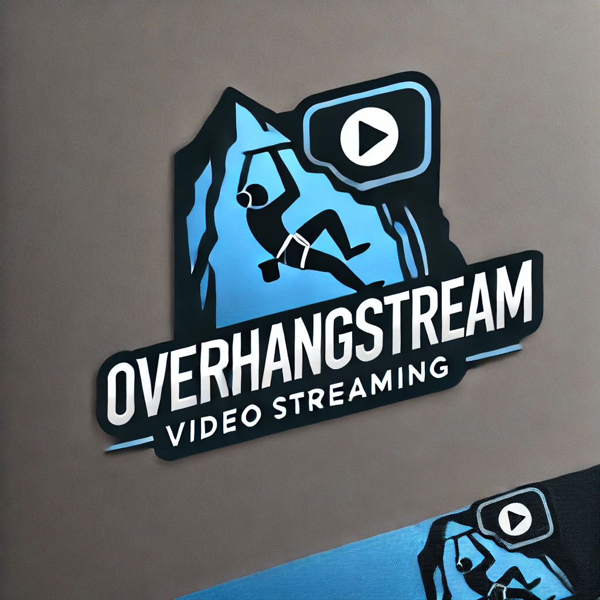

# OverHangStream 🚀🎥



**OverHangStream**은 실시간 영상 스트리밍 플랫폼을 개발하기 위한 프로젝트입니다.
현재 **HLS 스트리밍 기반의 기본적인 비디오 플레이어**를 구현한 상태이며,
앞으로 다양한 기능을 추가하여 완성도를 높여나갈 계획입니다.

---

## 🚀 프로젝트 목표

- **VOD 스트리밍 서비스**: 사용자가 동영상을 업로드하고, 다른 사용자들이 시청할 수 있는 기본 VOD 플랫폼 구현.
- **라이브 스트리밍 서비스**: 실시간으로 방송을 진행하고, 시청자들이 실시간으로 시청할 수 있는 기능 제공.
- **실시간 채팅 시스템**: 방송 중 시청자와 스트리머가 실시간으로 소통할 수 있는 채팅 기능 구현.
- **도네이션 시스템**: 시청자가 스트리머에게 도네이션을 할 수 있는 결제 및 메시지 시스템 제공.

---

## 🛠️ 기술 스택

| 영역               | 기술                    |
| ------------------ | ----------------------- |
| **Frontend**       | React, HTML, JavaScript |
| **Backend**        | NestJS                  |
| **Streaming**      | NGINX + RTMP 모듈, HLS  |
| **Transcoding**    | FFmpeg                  |
| **Infrastructure** | Docker, Docker Compose  |

---

## ▶ 실행 방법

### 1. RTMP 서버 실행

```bash
docker compose up
```

### 2. OBS 설정

OBS Studio → 제어 → 설정 → 방송 → 서버에 다음 입력

```bash
rtmp://localhost:1935/live
```

### 3. player.html 접속

http://localhost:8080/player.html

---

## 📌 개발 로드맵

### 1️⃣ VOD 스트리밍 서비스 (나만의 유튜브)

#### ✅ 1-1: 기본 인프라 설정 (1-2주)

- ✔️ Docker, Docker Compose 환경 구성
- ✔️ NestJS 백엔드 프로젝트 셋업
- ✔️ React 프론트엔드 프로젝트 셋업
- ✔️ 기본 사용자 인증 시스템 구현

#### 🚀 1-2: 동영상 업로드 시스템 (2주)

- 파일 업로드 API 개발
- 업로드된 영상 저장소 관리
- 영상 메타데이터(제목, 설명 등) 관리

#### 1-3: 트랜스코딩 파이프라인 (2-3주)

- FFmpeg 통합
- 다양한 해상도 변환 로직 구현 (720p, 480p, 360p 등)
- 트랜스코딩 작업 큐 시스템 개발

#### 1-4: HLS 스트리밍 구현 (2주)

- 동영상 세그먼트화 (3-5초 단위)
- HLS 매니페스트(.m3u8) 파일 생성
- NGINX 서버 설정

#### 1-5: 프론트엔드 플레이어 및 UI (2주)

- HLS 플레이어 구현
- 영상 목록 및 상세 페이지 구현
- 반응형 디자인 적용

#### 1-6: 품질 최적화 (1-2주)

- 적응형 비트레이트 스트리밍 구현
- 버퍼링 최적화
- 성능 테스트 및 개선

### 2️⃣ 라이브 스트리밍 서비스 (나만의 트위치)

#### 2-1: RTMP 스트리밍 서버 구축 (2주)

- NGINX RTMP 모듈 설정
- 스트림 키 생성 및 관리 시스템
- 스트리머 인증 시스템

#### 2-2: 라이브 스트림 HLS 변환 (2주)

- 실시간 트랜스코딩 파이프라인 구현
- 라이브 HLS 세그먼트 및 매니페스트 관리
- 지연 시간 최적화

#### 2-3: 라이브 스트림 관리 시스템 (1-2주)

- 스트림 상태 모니터링
- 방송 시작/종료 이벤트 처리
- 라이브 스트림 목록 및 검색 기능

#### 2-4: 라이브 스트리밍 프론트엔드 (2주)

- 라이브 방송 플레이어 구현
- 스트림 목록 및 상세 페이지
- 스트리머 프로필 페이지

### 3️⃣ 실시간 채팅 시스템

#### 3-1: WebSocket 서버 구현 (1-2주)

- NestJS WebSocket 게이트웨이 설정
- 채팅 메시지 처리 및 브로드캐스팅
- 채팅 이벤트 핸들링

#### 3-2: 채팅 클라이언트 구현 (1-2주)

- React 채팅 컴포넌트 개발
- 실시간 메시지 렌더링
- 채팅 UI/UX 개선

#### 3-3: 채팅 기능 확장 (1-2주)

- 이모티콘 지원
- 사용자 권한 관리 (운영자, 일반 시청자 등)
- 채팅 명령어 시스템

### 4️⃣ 도네이션 시스템

#### 4-1: 결제 시스템 통합 (2주)

- 결제 게이트웨이 연동 (Stripe, PayPal 등)
- 포인트/코인 시스템 구현
- 결제 내역 관리

#### 4-2: 도네이션 메시지 시스템 (1-2주)

- 도네이션 메시지 UI 구현
- 알림 효과 및 애니메이션
- 메시지 큐 및 관리 시스템

#### 4-3: TTS(Text-to-Speech) 통합 (1-2주)

- TTS API 연동 (Google Cloud TTS, Amazon Polly 등)
- 음성 설정 및 커스터마이징
- 부적절한 콘텐츠 필터링
